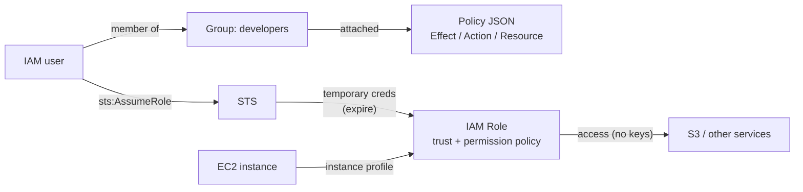

# Lab 01 — IAM & Security Foundations

IAM is the foundation under every AWS service and a dense interview topic. Master users, groups, roles, policies, and the permission evaluation model.

**Cost:** free. **Prerequisite:** [Lab 00](../00-account-setup/) done (IAM user + CLI working).

---

## Architecture



> Evaluation order on every request: **explicit Deny > Allow > default Deny**.

## Core theory

- **Principal** — the entity making a request (user, role, service). IAM answers: "is principal X allowed to do action Y on resource Z?"
- **Policy = JSON document** of statements; each statement has:
  - `Effect` — `Allow` or `Deny`.
  - `Action` — e.g. `s3:GetObject`, `ec2:RunInstances` (wildcards like `s3:*` allowed).
  - `Resource` — the ARN(s) it applies to.
  - `Condition` (optional) — e.g. only from an IP, only with MFA, by tag.
- **Policy types**
  - *Identity-based* — attached to a user/group/role ("what this identity may do").
  - *Resource-based* — attached to a resource (e.g. an S3 bucket policy); has a `Principal` field ("who may touch this resource"). This is the mechanism for **cross-account access**.
  - *Managed* (reusable: AWS-managed or customer-managed) vs *inline* (embedded 1:1 in one identity).
  - *Permission boundary* — the max permissions a user/role can have (intersection of boundary and policy). *SCP* (in Organizations) — the ceiling for an entire account.
- **Policy evaluation logic** (frequently asked): default is **implicit deny** → an applicable `Allow` grants access → but **any explicit `Deny` beats everything**. Order: Explicit Deny > Allow > Default Deny.
- **Roles & STS** — a role has no fixed credentials. An allowed principal calls `sts:AssumeRole` → STS issues *temporary credentials* (access key + secret + **session token**, expiring after N minutes/hours). A role has two parts:
  - *Permission policy* — what the role may do.
  - *Trust policy* — who may assume it (a service like `ec2.amazonaws.com`, another account, an identity provider).
- **Instance profile** — how EC2 receives a role so apps fetch temp creds automatically via metadata, **without embedding keys**. Same idea for a Lambda execution role.
- **Why roles beat long-lived access keys** — leaked long-lived keys are dangerous indefinitely; temp creds expire and rotate automatically and are easy to scope.

### Least-privilege policy example
```json
{
  "Version": "2012-10-17",
  "Statement": [{
    "Effect": "Allow",
    "Action": ["s3:GetObject"],
    "Resource": "arn:aws:s3:::my-lab-bucket/*"
  }]
}
```

## Hands-on steps

1. Create a **group** `developers`, attach a managed policy, add your IAM user.
2. Write a **custom least-privilege policy** (JSON) allowing only `s3:GetObject` on one bucket; attach and test.
3. Create an **IAM role** with a trust policy for EC2 (`ec2.amazonaws.com`) — you'll reuse this in Lab 03 as an instance profile.
4. Practice **assume-role** via CLI: create a role you can assume, run `aws sts assume-role`, use the temp creds.
5. Use the **IAM Policy Simulator** to confirm an action is allowed/denied and explain why.
6. Enable **IAM Access Analyzer** and review one sample finding.

## Cost & cleanup

- IAM is free. Delete leftover test roles/policies at the end for tidiness.

## Success criteria

- [ ] Write a least-privilege policy from scratch and explain each field.
- [ ] Explain user vs role and why roles beat long-lived keys.
- [ ] Successfully assume a role via CLI and understand temporary credentials.
- [ ] Correctly predict an allow/deny with the Policy Simulator.

## Interview talking points

- Policy evaluation (explicit deny wins); cross-account access via roles; why EC2 should use an instance role instead of embedded keys; permission boundary vs SCP.

## Watch out

- You can lock yourself out with a bad `Deny`. Keep your admin IAM user separate; test on a secondary user/role.
